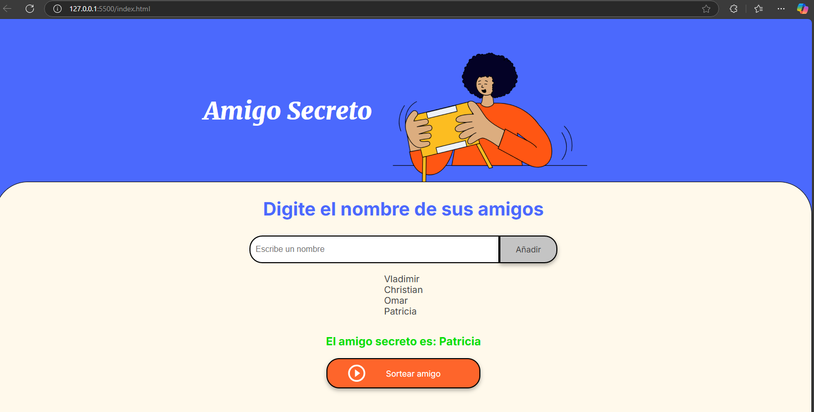

# Amigo Secreto 🎁

## Descripción
 Aplicación que permita a los usuarios ingresar nombres de amigos en una lista para luego realizar un sorteo aleatorio y determinar quién es el "amigo secreto".

## Funcionalidades ✨
- 📌 **Agregar amigos**: Los usuarios pueden ingresar nombres en un campo de texto y añadirlos a la lista.
- 🔄 **Visualización de la lista**: Muestra en pantalla todos los nombres ingresados.
- 🎲 **Sortear un amigo secreto**: Selecciona aleatoriamente un nombre de la lista.
- ⚠ **Validaciones**:
  - Evita ingresar nombres vacíos.
  - No permite realizar el sorteo si no hay nombres en la lista.

## Capturas de Pantalla 🖼
### **Pantalla Principal**


### **Ingreso de Nombres**


### **Sorteo Realizado**


## Uso 🚀
1. Escribe el nombre de un participante en el campo de entrada.
2. Haz clic en el botón "Añadir" para agregarlo a la lista.
3. Repite el proceso para agregar más participantes.
4. Haz clic en el botón "Sortear amigo" para obtener un resultado aleatorio.

## Tecnologías Usadas 🛠
- **HTML5**: Estructura de la aplicación.
- **CSS3**: Diseño y estilos visuales.
- **JavaScript**: Lógica de la aplicación y manipulación del DOM.

## Instalación y Ejecución 🖥
1. Clona este repositorio:
   ```sh
   git clone https://github.com/tu-usuario/amigo-secreto.git
   ```
2. Abre el archivo `index.html` en tu navegador.
3. ¡Disfruta del sorteo de Amigo Secreto! 🎉

## Contribuciones 🤝
Si deseas mejorar el proyecto, ¡eres bienvenido a contribuir! Puedes hacer un fork y enviar un pull request con mejoras o nuevas funcionalidades.

## Autor 👨‍💻
Creado por Vladimir Guerra

## Licencia 📜
Este proyecto está bajo la licencia MIT.

